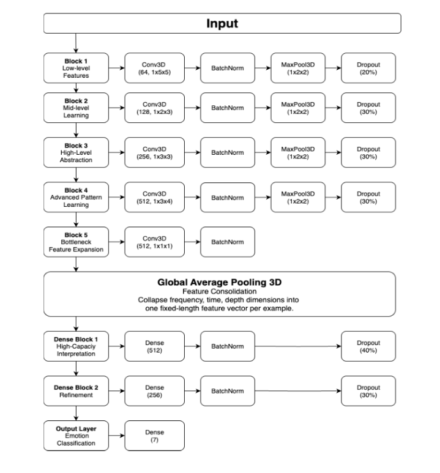

# Speech Emotion Recognition
This is a repository of a project that I worked with my teammates in subject DPL302m at FPT University, I re-up this project because the original project was set "private" by my teacher.

All contents in this README are parts of our project report.

### Team Members
- Tran Hoang Tuan Hung (coder)
- Phan Quoc Anh (coder)
- Huynh Han Dong (coder)
- Tran Quoc Huan (report writer)
- Nguyen Van Anh Duy (report writer)
- Nguyen Truong Phuc Thinh (report writer)

## Requirement
- Python >= 3.9
- Jupiter Notebook
- pandas, numpy, matplotlib, seaborn
- librosa
- sklearn, audiomentations
- tensorflow and CUDA (check  for GPU support version)
- streamlit >= 1.35.0 (to run the demo app.py)

## Dataset
To build a comprehensive speech emotion recognition model, we combined four widely used emotional speech datasets: RAVDESS, TESS, SAVEE, and EmoDB. There are 5147 audio samples in WAV format, encompassing seven emotion categories: **neutral, happy, sad, angry, fearful, surprised, and disgusted**.

### RAVDESS (Livingstone & Russo, 2018)
The portion of the RAVDESS contains 1440 files: 60 trials per actor x 24 actors = 1440. The RAVDESS contains 24 professional actors (12 female, 12 male), vocalizing two lexically matched statements in a neutral North American accent. Speech emotions include calm, happy, sad, angry, fearful, surprised, and disgusted expressions. Each expression is produced at two levels of emotional intensity (normal, strong), with an additional neutral expression.

### TESS (Sahar & Dupuis, 2010)
TESS includes 2800 audio files featuring two actresses (aged 26 and 64) speaking 200 target words in the carrier phrase "Say the word _". The dataset is organised such that each of the two female actors and their emotions are contained within their own folder. Moreover, within that, all 200 target words’ audio files can be found.

### SAVEE (Haq & Jackson, 2009)
The SAVEE database was recorded from four native English male speakers, postgraduate students and researchers at the University of Surrey, aged from 27 to 31 years. Each speaker recorded 15 phonetically-balanced TIMIT sentences per emotion: 3 common, two emotion-specific, and 10 generic sentences that were different for each emotion and phonetically-balanced. The three common and 2 × 6 = 12 emotion-specific sentences were recorded as neutral to give 30 neutral sentences. There are a total of 480 audio files.

### EmoDB (Burkhardt et al., 2005)
The EmoDB database is a German database of emotions. Ten professional speakers (five males and five females) participated in data recording. The database contains a total of 535 utterances. This dataset comprises seven emotions: anger, boredom, anxiety, happiness, sadness, disgust, and neutral. The boredom class was excluded to maintain consistency with the other datasets’ emotion categories. So, the total number of samples we used is 454 (after removing the boredom category).

## Audio processing and Feature extraction 
To convert Raw Audio Signals into a format suitable for deep learning models, we transformed each waveform into a Mel-Spectrogram using the Librosa library. This transformation captures both frequency and temporal characteristics of speech, which are critical for emotion recognition. Specifically, we extracted 3D features in the form of a fixed-sized array with dimensions:

- **Timesteps**: the number of chunks split from an audio
- **Number of n_mels**: the number of Mel-frequency bins (typically 128).
- **Channel**: number of channels.
- **Frame_per_step**: the number of frames in one specific chunk 

The Frame_per_step is resized by padding and truncating to fix the size (60 frames per chunk).

The power spectrogram is converted to decibels (dB) scale, which is logarithmic, better to reflect human auditory perception of loudness and pitch. 

Lastly, we normalize decibel values between 0 and 1 by the Min-Max scaling technique. This step helps to ensure all the input values stay in the same scale, which encourages the model to learn more stably and faster.

## Data Augmentation Techniques
To improve model generalization and simulate real-world audio variability, we augmented the dataset using the audiomentations library. Key techniques included:
- **AddGaussianNoise**: Injected random noise to simulate low-quality or background-dense recordings.
- **PitchShift**: Modified pitch slightly to account for natural variations in speaker tone.
- **TimeStretch**: Stretched or compressed speech tempo without changing pitch, mimicking fast or slow speaking styles.
- **Shift**: Introduced random temporal shifts to simulate audio misalignment or timing offsets.

## Model architecture
Our model architecture is based on a 3D Convolutional Neural Network (3D CNN), which has proven effective in extracting spatial and temporal features from mel-spectrogram representations of audio.

Diagram of the layer flow of our model:

## Training Strategy
The dataset was divided into training, validation, and testing subsets using a 70:15:15 split. The `Adam` optimizer was employed for its adaptive learning rate capabilities and fast convergence. The model was trained using a custom `Focal Loss` function. By fine-tuning class-specific weights, we adapted the loss to reflect the difficulty of each emotion better. This allowed the model to focus more on hard-to-classify examples and helped reduce the overall loss.
